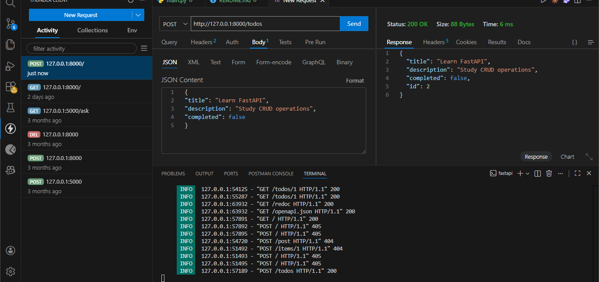
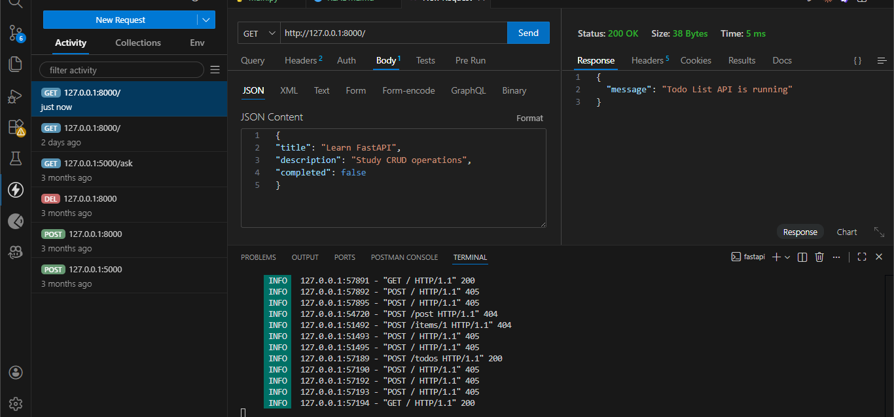
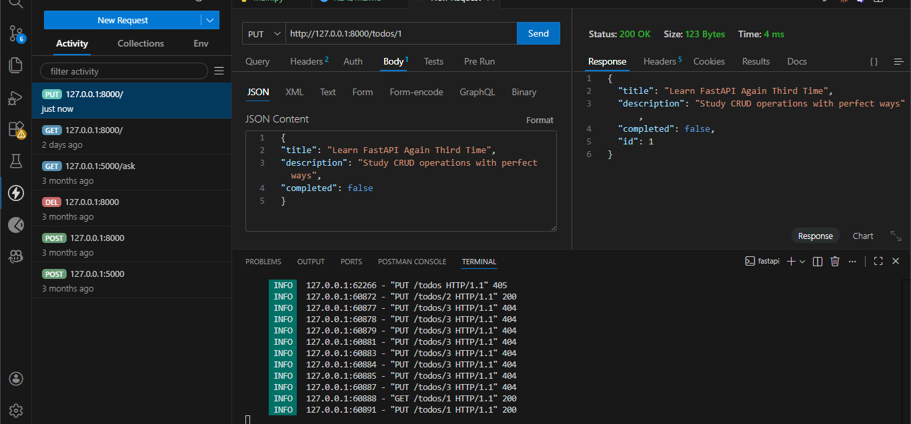
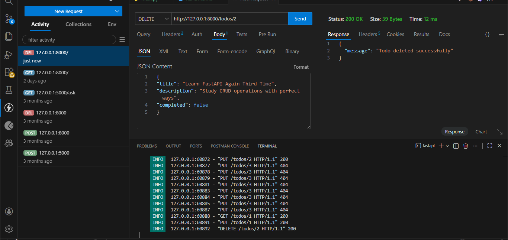
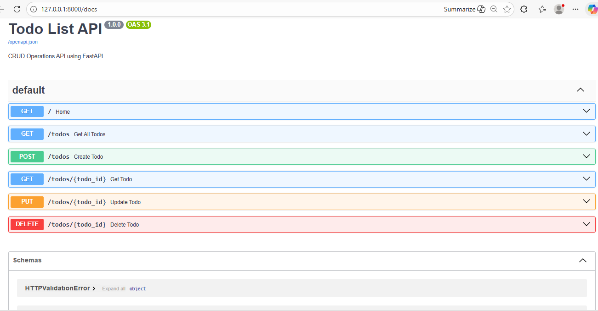

# ✅ Todo List API (FastAPI + Pydantic)

A simple, clean, and beginner‑friendly **Todo List REST API** built using **FastAPI** and **Pydantic**.
This project demonstrates how to build a clean and beginner-friendly **CRUD (Create, Read, Update, Delete) REST API** using FastAPI and Pydantic.

---

## 📌 Project Overview

This API allows users to:

* ➕ Create a Todo
* 📖 Read all Todos
* 🔍 Read a single Todo by ID
* ✏️ Update an existing Todo
* 🗑️ Delete a Todo

The project uses **in‑memory storage**, making it easy to understand without database complexity.

---

## 🧠 Technologies Used

* **Python 3.9+**
* **FastAPI** – API framework
* **Pydantic** – Data validation
* **Uvicorn** – ASGI server

---

## 📁 Project Structure

```
Todo-List-API/
│
├── main.py            # Main FastAPI application
├── requirements.txt  # Project dependencies
└── README.md          # Project documentation
├── screenshots/       # Screenshots of API output and testing
```

---

## ⚙️ Installation & Setup (One‑Click Friendly)

### 1️⃣ Download Project

* Download ZIP from GitHub
* Extract the folder

### 2️⃣ Install Dependencies

```bash
pip install -r requirements.txt
```

If `requirements.txt` is not present, install manually:

```bash
pip install fastapi uvicorn
```

---

## ▶️ Run the Application

```bash
uvicorn main:app --reload
```

You will see output like:

```
Uvicorn running on http://127.0.0.1:8000
```

---

## 🌐 API Access

| Purpose           | URL                                                        |
| ----------------- | ---------------------------------------------------------- |
| Home              | [http://127.0.0.1:8000](http://127.0.0.1:8000)             |
| Swagger UI (Docs) | [http://127.0.0.1:8000/docs](http://127.0.0.1:8000/docs)   |
| ReDoc             | [http://127.0.0.1:8000/redoc](http://127.0.0.1:8000/redoc) |

---

## 🔄 API Endpoints (CRUD)

### ➕ Create Todo

```
POST /todos
```

**Request Body:**

```json
{
  "title": "Learn FastAPI",
  "description": "Study CRUD operations",
  "completed": false
}
```

---

### 📖 Get All Todos

```
GET /todos
```

---

### 🔍 Get Todo by ID

```
GET /todos/{todo_id}
```

---

### ✏️ Update Todo

```
PUT /todos/{todo_id}
```

**Request Body:**

```json
{
  "title": "Updated Title",
  "description": "Updated Description",
  "completed": true
}
```

---

### 🗑️ Delete Todo

```
DELETE /todos/{todo_id}
```

---

## 📸 Screenshots

Include screenshots of your API requests and responses here. Add images using Markdown syntax:

```markdown





```

> Make sure to save your screenshots in the `screenshots/` folder inside your project directory.

---

## 🎯 Project Highlights

* ✔ Built with FastAPI
* ✔ Uses Pydantic for data validation
* ✔ Implements full CRUD operations
* ✔ Follows REST API best practices
* ✔ Clean, readable, and beginner-friendly structure

This project is ideal for learning how modern Python APIs are built using FastAPI.

---

## 🚀 Future Improvements (Optional)

* Add database (SQLite / MySQL)
* Add authentication
* Deploy online (Render / Railway)
* Add frontend UI

---

## 👨‍💻 Author

**Waqar Ali**
Python & Web Developer

---

⭐ *If you like this project, give it a star!*
